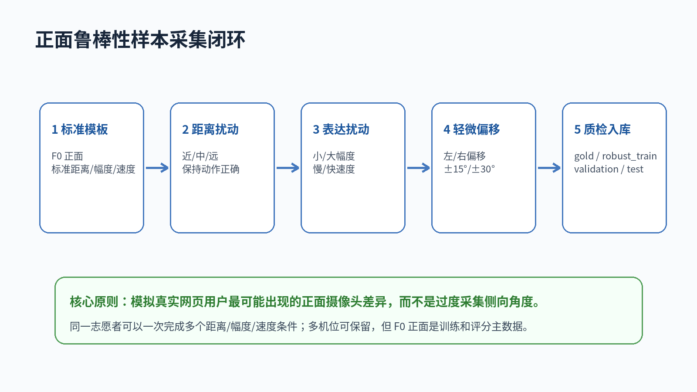
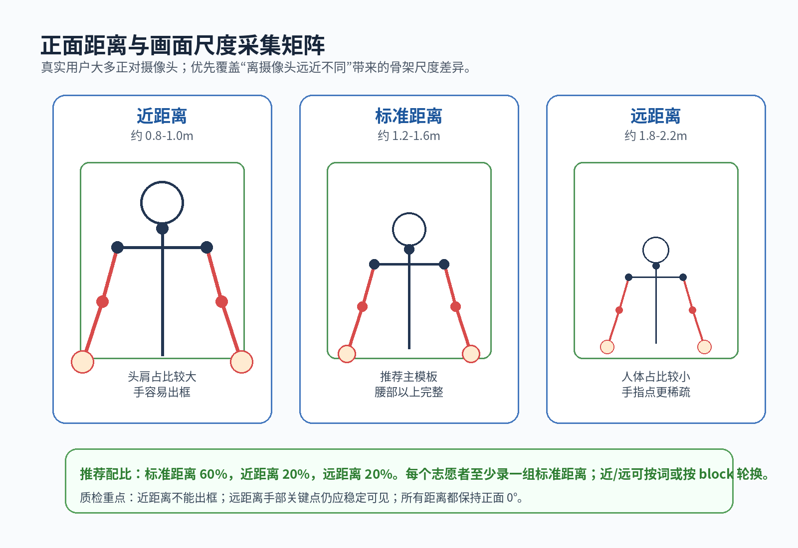
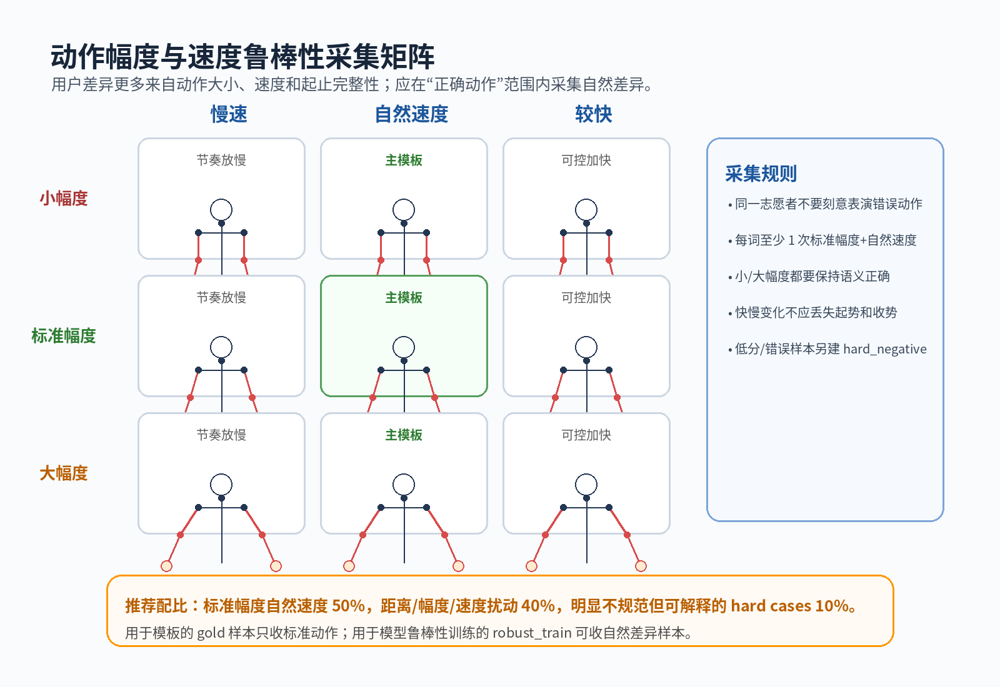
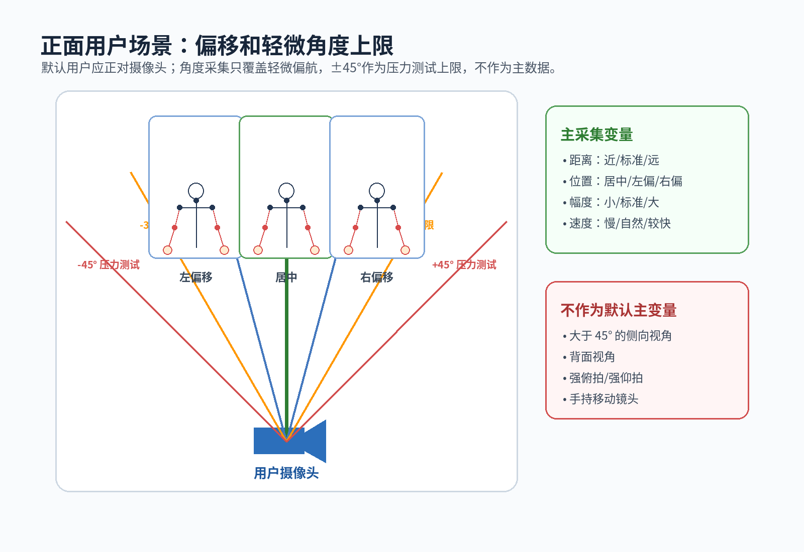

# 手语学习宇宙正面鲁棒性样本录制手册

版本：2026-06-24

派生自：`sign_language_sample_recording_manual_20260624.md`

定位：保留旧版“多机位通用采集手册”，本文件作为更贴近真实网页用户场景的正面采集方案

适用目的：提升当前 Web Holistic + 模板评分路线在真实用户正对摄像头使用时的鲁棒性

## 1. 核心判断

真实用户使用手语宇宙网页进行评分时，大概率是手机、平板或电脑摄像头正对身体，不太会偏离到 45° 以上。因此，当前采集重点不应是大量侧向机位，而应优先覆盖正面场景下的主要变化：

1. 离摄像头远近不同，导致人体在画面中的尺度不同。
2. 动作幅度不同，导致手部轨迹、出框风险和关键点稳定性不同。
3. 动作速度不同，导致关键帧密度和时间对齐难度不同。
4. 站位轻微偏左/偏右，或摄像头略高/略低。
5. 个体差异，包括身高、臂长、手型、左右手习惯、衣着和背景。

新版采集原则：

```text
正面 F0 是主数据。
距离/尺度、幅度、速度、轻微偏移是主变量。
±15°/±30° 是可选补充。
±45° 只作为压力测试上限，不作为默认核心采集。
```



## 2. 和旧版手册的关系

旧版手册保留，适用于通用多机位、研究型多视角、遮挡分析和未来三维姿态研究。新版手册用于当前最实用的一条路线：让网页端常见用户在正对摄像头时能更稳定评分。

| 项目 | 旧版多机位手册 | 新版正面鲁棒性手册 |
|---|---|---|
| 主假设 | 多角度同步录制能增强模型 | 用户大概率正对摄像头 |
| 主机位 | F0 + L45 + R45 | F0 正面 |
| 主变量 | 视角角度、遮挡、多视角 | 距离、画面尺度、动作幅度、速度、偏移 |
| 45° 视角 | 推荐机位 | 压力测试上限 |
| 样本成本 | 视角视频数较多 | 动作条件数更可控 |
| 当前推荐用途 | 研究/长期扩展 | 当前评分鲁棒性提升 |

## 3. 推荐采集矩阵

### 3.1 正面距离与画面尺度



正面距离是当前最重要的鲁棒性变量。用户在不同设备上使用时，摄像头距离可能从 0.8m 到 2.2m 不等。

| 距离条件 | 建议距离 | 画面特征 | 主要风险 | 推荐占比 |
|---|---:|---|---|---:|
| 近距离 | 0.8m-1.0m | 头肩占比较大，手部动作容易贴边 | 手出框、手部过大、运动模糊 | 20% |
| 标准距离 | 1.2m-1.6m | 腰部以上完整，手部和脸部清楚 | 主模板场景 | 60% |
| 远距离 | 1.8m-2.2m | 人体占比较小，手指点稀疏 | 手部关键点不稳定、细节损失 | 20% |

采集要求：

1. 三个距离都保持正面 0°。
2. 每名志愿者至少录一组标准距离。
3. 近距离和远距离可以按词轮换，也可以按 block 轮换。
4. 近距离样本必须保证双手动作不出框。
5. 远距离样本必须保证手部关键点仍能稳定识别。

### 3.2 动作幅度与速度



动作幅度和速度应在“动作仍然正确”的范围内自然变化，不要让志愿者故意做错动作。

| 条件 | 定义 | 用途 | 注意 |
|---|---|---|---|
| 标准幅度 + 自然速度 | 按示范视频或标准教学动作完成 | `template_gold` 和主模板增强 | 每个词每人至少 1 次 |
| 小幅度 | 动作比示范略小，但语义仍正确 | 增强低幅度用户鲁棒性 | 不能小到动作语义丢失 |
| 大幅度 | 动作比示范略大，但不夸张 | 增强大动作和出框边界识别 | 不应贴边或出框 |
| 慢速 | 节奏放慢，起止完整 | 时间对齐、DTW 和关键帧覆盖 | 不要录成停顿过长 |
| 较快 | 稍快但可辨 | 快速用户鲁棒性 | 不应丢失手型和方向 |

推荐配比：

| 类型 | 占比 |
|---|---:|
| 标准幅度 + 自然速度 | 50% |
| 距离/幅度/速度扰动 | 40% |
| 明显不规范但可解释的 hard cases | 10% |

`template_gold` 只收标准动作；`robust_train` 可以收正确范围内的自然差异；明显错误动作应进入 `hard_negative` 或废弃，不要混入标准模板。

### 3.3 轻微偏移和角度上限



角度变量仍有价值，但不应过度采集。更现实的情况是用户身体略偏左、略偏右，或摄像头与身体有轻微角度。

| 条件 | 建议 | 用途 |
|---|---|---|
| 居中 0° | 默认主采集 | 主模板、主要训练集 |
| 左/右偏移 | 身体在画面中略偏左或略偏右，仍完整入框 | 模拟用户站位不准 |
| ±15° | 身体轻微偏航 | 真实轻微角度误差 |
| ±30° | 角度上限补充 | 评估轻度侧向鲁棒性 |
| ±45° | 少量压力测试 | 不作为默认核心数据 |
| 90° 侧面/背面 | 初期不建议 | 研究型扩展 |

## 4. 推荐低成本采集方案

### 4.1 第一轮：正面鲁棒性试采

```text
人数：6 名志愿者
词汇：10 个 P0 词
每词 take：4 次
机位：F0 正面 1 台相机即可
条件：标准距离标准动作 2 次 + 距离/幅度/速度扰动 2 次
动作事件数：6 × 10 × 4 = 240
视角视频数：240
预计现场时间：半天到一天
```

每个词建议 4 个 take：

| take | 条件 | 说明 |
|---|---|---|
| T01 | 标准距离 + 标准幅度 + 自然速度 | gold 候选 |
| T02 | 标准距离 + 标准幅度 + 自然速度 | gold 候选，减少偶然性 |
| T03 | 近距离或远距离 | 由采集表安排轮换 |
| T04 | 小/大幅度或慢/较快 | 由采集表安排轮换 |

### 4.2 第二轮：加入轻微偏移

```text
人数：12-20 名志愿者
词汇：10 个 P0 词 + 5 个 P1 词
每词 take：4-5 次
机位：F0 正面为主；如果设备充足，可加一台 L15/R15
重点：距离尺度 + 幅度速度 + 居中偏移
```

第二轮可以加入：

1. 左偏移 / 右偏移。
2. ±15° 轻微偏航。
3. 少量 ±30°。

不建议第二轮就大量录 ±45°，除非已有证据表明网页用户经常这么用。

### 4.3 第三轮：完整词库扩展

```text
人数：30 名左右
词汇：47 个学习词
每词 take：2-3 次
机位：F0 正面必录
多角度：仅 P0/P1 或遮挡明显的词补录 ±15°/±30°
```

## 5. 条件安排表

为了避免现场混乱，不建议每个词都完整采 3 距离 × 3 幅度 × 3 速度。应采用轮换设计。

### 5.1 P0 10 词第一轮条件表

| 词 | T01 | T02 | T03 | T04 |
|---|---|---|---|---|
| 香蕉 | 标准 | 标准 | 近距离 | 小幅度 |
| 花 | 标准 | 标准 | 远距离 | 大幅度 |
| 汽车 | 标准 | 标准 | 近距离 | 较快 |
| 虎 | 标准 | 标准 | 远距离 | 慢速 |
| 月亮 | 标准 | 标准 | 近距离 | 大幅度 |
| 跳 | 标准 | 标准 | 远距离 | 较快 |
| 朋友 | 标准 | 标准 | 近距离 | 小幅度 |
| 指示 | 标准 | 标准 | 远距离 | 右偏移 |
| 唱歌 | 标准 | 标准 | 标准距离 | 表情自然变化 |
| 馋 | 标准 | 标准 | 近距离 | 表情自然变化 |

说明：

1. T01/T02 用于 `template_gold` 候选。
2. T03/T04 用于 `robust_train` 候选。
3. 表情相关词可以把“表情自然变化”作为一个条件，但不能故意夸张到语义错误。

### 5.2 志愿者间轮换

不同志愿者可以换一套扰动条件，避免所有人都录同样的扰动。

| 志愿者组 | T03 条件 | T04 条件 |
|---|---|---|
| A 组 | 近距离 | 小幅度 |
| B 组 | 远距离 | 大幅度 |
| C 组 | 左偏移 | 慢速 |
| D 组 | 右偏移 | 较快 |
| E 组 | +15° | 标准动作 |
| F 组 | -15° | 标准动作 |

这样可以在不大幅增加 take 数的情况下覆盖更多真实变化。

## 6. 录制参数

| 项目 | 标准 |
|---|---|
| 画面方向 | 横屏 16:9 |
| 分辨率 | 推荐 1920×1080，最低 1280×720 |
| 帧率 | 30fps；快速动作可用 60fps 但必须标记 |
| 摄像头 | F0 正面，优先后置摄像头；若用前置摄像头需记录是否镜像 |
| 标准距离 | 1.2m-1.6m |
| 近距离 | 0.8m-1.0m |
| 远距离 | 1.8m-2.2m |
| 取景 | 头顶到腰部，肩、肘、手腕、双手全程可见 |
| 光照 | 正面柔光，无逆光 |
| 背景 | 简洁纯色或低纹理背景 |
| 音频 | 非必要，建议关闭或后处理去除 |

## 7. 现场录制口令

推荐统一口令：

```text
请站到正面标记点，看向摄像头。
当前条件：标准距离，标准幅度，自然速度。
现在录制：香蕉，第 1 次。
准备，3，2，1，开始。
动作完成后回到自然姿态，保持 1 秒。
好，下一次。
```

扰动条件口令示例：

```text
当前条件：近距离。请向前站到近距离标记点，动作仍然完整，不要让手出框。
当前条件：小幅度。请动作略小一些，但手型、方向和节奏仍然正确。
当前条件：较快。请稍微加快，但不要省略起势和收势。
```

## 8. 地面标记

建议在地面贴 3 个距离点和 3 个横向偏移点。

```text
             摄像头 F0
                |
       近距离点 0.8-1.0m
                |
       标准点 1.2-1.6m
     左偏移   居中   右偏移
                |
       远距离点 1.8-2.2m
```

操作建议：

1. 标准点是默认站位。
2. 近距离点只用于 T03/T04 或指定 block。
3. 远距离点用于评估人体占比较小时的关键点稳定性。
4. 左/右偏移只偏半个肩宽到一个肩宽，不要让身体出框。

## 9. Metadata 字段扩展

在旧版 `clip_index.csv` 基础上，新增这些字段：

```csv
distance_condition,scale_condition,amplitude_condition,speed_condition,offset_condition,yaw_condition,template_tier
standard,standard,standard,natural,center,0deg,template_gold_candidate
near,large,standard,natural,center,0deg,robust_train_candidate
far,small,small,slow,left_offset,0deg,robust_train_candidate
standard,standard,standard,natural,center,+15deg,robust_train_candidate
```

字段建议：

| 字段 | 可选值 |
|---|---|
| `distance_condition` | `near` / `standard` / `far` |
| `scale_condition` | `large_body` / `standard` / `small_body` |
| `amplitude_condition` | `small` / `standard` / `large` |
| `speed_condition` | `slow` / `natural` / `fast` |
| `offset_condition` | `center` / `left_offset` / `right_offset` |
| `yaw_condition` | `0deg` / `+15deg` / `-15deg` / `+30deg` / `-30deg` / `+45deg` / `-45deg` |
| `template_tier` | `template_gold_candidate` / `robust_train_candidate` / `hard_negative` / `discard` |

## 10. 数据集分层

| 分层 | 收录条件 | 用途 |
|---|---|---|
| `template_gold` | 标准距离、标准幅度、自然速度、动作正确、F0 清晰 | 标准模板 |
| `robust_train` | 动作正确，但距离/幅度/速度/偏移有自然扰动 | 鲁棒性训练 |
| `hard_negative` | 用户常见错误或明显低质量，但仍可解释 | 错误检测、低分反馈 |
| `validation` | 按志愿者划分，不与训练同人 | 调参 |
| `test_holdout` | 完全独立志愿者和场次 | 最终评测 |

重要规则：训练、验证、测试必须按志愿者划分，不要把同一个人的不同条件样本拆到不同集合。

## 11. 质检重点

正面鲁棒性版本的质检重点和旧版略有不同：

| 条件 | 合格标准 | 常见失败 |
|---|---|---|
| 近距离 | 双手全程在画面内 | 手出框、脸被手挡住 |
| 远距离 | 手部关键点仍稳定 | 手太小、手指点丢失 |
| 小幅度 | 语义仍正确 | 动作变成不完整 |
| 大幅度 | 不贴边、不出框 | 轨迹过大、运动模糊 |
| 慢速 | 起止完整，不拖太久 | 中间停顿过长 |
| 较快 | 手型和方向仍清楚 | 省略动作、关键帧不足 |
| 偏移 | 身体仍完整在框内 | 半边身体或手臂出框 |

自动质检建议记录：

```text
pose_visible_ratio
left_hand_ratio
right_hand_ratio
face_core_ratio
hand_out_of_frame_flag
motion_blur_flag
body_scale_ratio
```

其中 `body_scale_ratio` 可以用肩宽/画面宽度、头肩高度/画面高度等近似指标估计，用于区分近/中/远距离样本。

## 12. 和当前评分算法的衔接

当前网页评分依赖：

```text
用户视频帧
  -> Web Holistic 提取 pose / hands / face_core landmarks
  -> 上传 landmark_rows
  -> 后端进行模板相似度或捕获质量评分
```

因此，距离和幅度鲁棒性样本的主要价值是：

1. 增强模板对人体尺度变化的容忍度。
2. 增强不同动作幅度和速度下的时间对齐。
3. 改善低分反馈，区分“动作错了”和“拍摄太近/太远/出框”。
4. 为后续模型训练提供更接近真实用户的分布。

处理建议：

1. 先用 `template_gold` 建立标准模板。
2. 用 `robust_train` 验证模板匹配是否对距离/幅度/速度过敏。
3. 如果某个词对距离很敏感，为该词引入尺度归一化或多模板。
4. 如果某个词对速度很敏感，优先改进时间对齐，而不是简单增加帧数。

## 13. 推荐第一轮执行方案

最终建议第一轮不要录多角度，而是录正面鲁棒性矩阵：

```text
人数：6 名志愿者
词汇：10 个 P0 词
每词：4 次
机位：F0 正面
总动作事件：240
总视频数：240
重点变量：标准/近/远距离，小/标准/大幅度，慢/自然/较快速度，少量左右偏移
```

可选增强：

```text
如果设备充足：
  增加一台 L15 或 R15 机位，而不是直接上 L45/R45。
如果需要压力测试：
  每名志愿者只抽 2-3 个词录 ±30° 或 ±45°。
```

第一轮完成后的判断标准：

1. 标准距离样本能稳定得到高质量 Holistic 关键点。
2. 近距离样本的主要问题是否是出框。
3. 远距离样本的主要问题是否是手部关键点稀疏。
4. 小幅度/快速样本是否导致低分或误判。
5. 是否需要在前端给用户提示“请离远一点/请靠近一点/请把双手放入画面”。

如果这些问题被识别出来，再扩大人数和词表，比直接堆多角度样本更有效。
