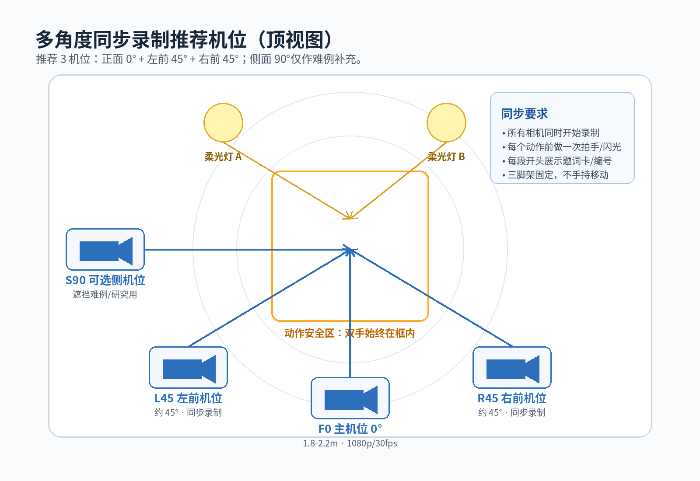
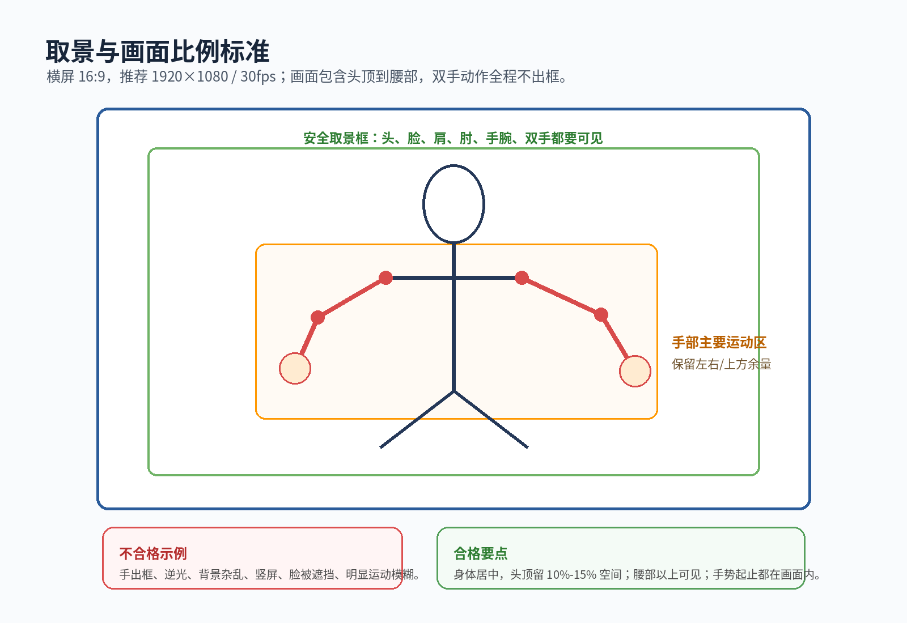
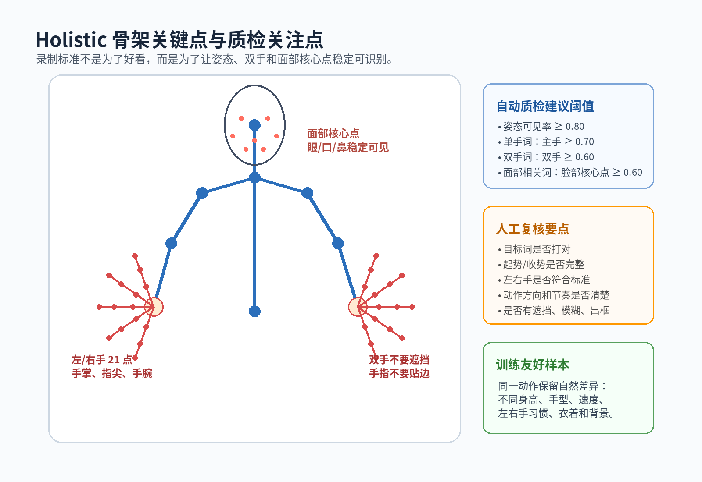
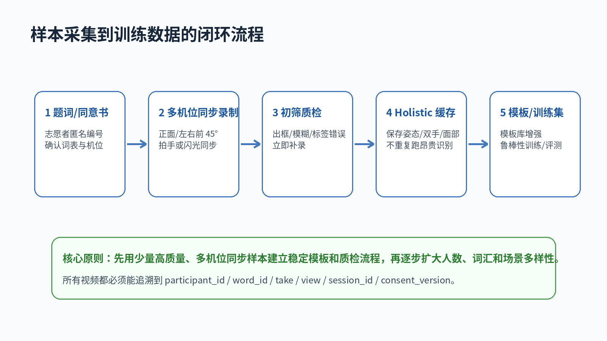

# 手语学习宇宙样本视频录制操作手册

版本：2026-06-24

适用项目：手语学习宇宙 / Sign Language Universe

适用目的：标准动作模板扩充、评分鲁棒性增强、后续模型训练与评测集建设

## 1. 总体目标

本手册用于组织志愿者录制更丰富的手语样本视频。采集目标不是单纯多录视频，而是以可控成本得到可训练、可复核、可追溯的数据。

当前推荐路线是：

1. 先围绕当前已上线评分模板的 10 个词建立稳定、多人的模板与验证数据。
2. 再扩展到网页学习词表中的 47 个词。
3. 每个动作尽量采用多机位同步录制，减少重复表演成本，同时得到正面和斜侧面视角。
4. 每段视频都必须有清晰标签、志愿者匿名编号、词汇编号、机位编号、录制轮次和质检结果。

当前 P0 优先录制词：

| 优先级 | 词汇 | 用途 |
|---|---|---|
| P0 | 香蕉、花、汽车、虎、月亮、跳、朋友、指示、唱歌、馋 | 当前挑战页已开放评分模板，优先扩充标准模板与鲁棒性样本 |
| P1 | 你好、谢谢、爸爸、学习、文化等基础词 | 连接现有表达测评/学习模块，尽快扩展模板库 |
| P2 | 其余网页学习词表 | 完整词库建设与长期模型训练 |

## 2. 推荐采集规模

不要一开始追求“人数、词数、场景全覆盖”。建议按阶段推进。

| 阶段 | 目标 | 人数 | 词数 | 每词次数 | 机位 | 产生动作事件 | 产生视角视频 |
|---|---:|---:|---:|---:|---:|---:|---:|
| A. 小规模试采 | 验证流程、机位、命名、质检 | 3 人 | 10 个 P0 词 | 3 次 | 3 机位 | 90 | 270 |
| B. 核心模板增强 | 建立多人模板和初步评测集 | 12 人 | 10 个 P0 词 | 3 次 | 3 机位 | 360 | 1080 |
| C. 稳定鲁棒性集 | 覆盖更多身高、手型、速度和衣着 | 20 人 | 15 个词 | 3 次 | 3 机位 | 900 | 2700 |
| D. 全词库扩展 | 覆盖当前 47 个学习词 | 30 人 | 47 个词 | 2 次 | F0 正面为主，P0/P1 保留 3 机位 | 2820+ | 按词汇优先级增加 |

计算公式：

```text
动作事件数 = 志愿者人数 × 词汇数 × 每词次数
视角视频数 = 动作事件数 × 机位数
```

对于初期算法，最关键的是 F0 正面机位。L45/R45 的价值是增强遮挡鲁棒性、做多视角训练和后续三维/姿态对齐研究。S90 侧面机位不是必需项，只建议在少量难词上补录。

## 3. 标准机位设计

推荐同一个志愿者一次表演，同时由 3 台相机录制：



### 3.1 必选机位

| 机位代码 | 角度 | 位置 | 用途 | 是否必需 |
|---|---:|---|---|---|
| F0 | 0° 正面 | 志愿者正前方 | 当前评分主视角、模板库主数据 | 必需 |
| L45 | 左前约 45° | 志愿者左前方 | 手部遮挡补充、多视角训练 | 推荐 |
| R45 | 右前约 45° | 志愿者右前方 | 手部遮挡补充、多视角训练 | 推荐 |

### 3.2 可选机位

| 机位代码 | 角度 | 位置 | 使用场景 |
|---|---:|---|---|
| S90L / S90R | 左/右侧 90° | 志愿者侧面 | 研究遮挡、动作深度、侧向运动轨迹 |
| H15 | 轻微俯视 10°-15° | 正前方略高 | 手部被身体遮挡严重时可补充 |

不建议初期录制背面视角。背面视角对当前学习评分价值较低，会增加标注与存储成本。

### 3.3 摄像头高度和距离

| 项目 | 标准 |
|---|---|
| 摄像头高度 | 镜头中心约在胸口到肩部高度，通常 1.2m-1.5m；不要明显仰拍或俯拍 |
| F0 距离 | 1.8m-2.2m，确保头顶到腰部都在画面内 |
| L45/R45 距离 | 1.8m-2.4m，角度约 45°，不要变成侧面 |
| 三脚架 | 必须固定；不要手持；不要边录边移动 |
| 焦距 | 手机默认广角即可；不要使用夸张超广角导致手部变形 |

## 4. 画面比例与取景标准

推荐横屏 16:9，不推荐竖屏。



| 项目 | 标准 |
|---|---|
| 分辨率 | 推荐 1920×1080；最低 1280×720；可录 4K 后统一降采样 |
| 帧率 | 推荐 30fps；快速动作可用 60fps，但需在 metadata 中标记 |
| 编码 | MP4 / H.264 或 H.265；后续入库可转 H.264 |
| 画面方向 | 横屏 landscape；禁止竖屏 portrait |
| 构图范围 | 头顶到腰部可见；肩、肘、手腕、双手全程可见 |
| 头顶余量 | 画面高度约 10%-15% |
| 手部余量 | 动作最高/最左/最右位置仍留边，不贴边 |
| 镜像 | 尽量使用后置摄像头；若前置摄像头保存镜像，必须标记 `mirrored=true` |
| 音频 | 非必要。若无研究需要，建议关闭或后处理去除音频以降低隐私风险 |

录制时每个动作应包含：

1. 起势前中立姿态 0.5-1 秒。
2. 完整手语动作。
3. 收势后中立姿态 0.5-1 秒。

多数词建议单条 clip 时长 2-6 秒。复杂词可以延长到 8 秒，但不要录成很长的空白片段。

## 5. 背景、光照、衣着要求

### 5.1 背景

| 项目 | 推荐 | 不推荐 |
|---|---|---|
| 背景类型 | 哑光纯色墙、纯色布幕、浅灰/浅蓝背景 | 书架、走动人群、强纹理海报、玻璃反光 |
| 背景距离 | 志愿者距离背景至少 0.8m-1.5m，减少阴影 | 紧贴墙面导致强阴影 |
| 颜色 | 与肤色、衣服、手部有明显对比 | 肤色墙、复杂花纹、与衣服同色 |
| 动态干扰 | 背景保持静止 | 风扇、屏幕视频、过路人 |

如果目标是模板库，背景应尽量统一；如果目标是鲁棒性训练，可在第二阶段加入少量不同背景，但必须在 metadata 中记录。

### 5.2 光照

| 项目 | 标准 |
|---|---|
| 主光 | 正前方或左右前 45° 柔光，脸和双手清楚 |
| 亮度 | 手指关节可辨，不能大面积过曝或欠曝 |
| 逆光 | 禁止窗口/强灯在志愿者背后 |
| 阴影 | 手部和脸部不要有强硬阴影 |
| 自动曝光 | 尽量锁定曝光/白平衡；若无法锁定，至少保持环境稳定 |

### 5.3 衣着和个人状态

| 项目 | 标准 |
|---|---|
| 衣服 | 纯色上衣，优先深色或与背景形成对比 |
| 袖口 | 不遮住手腕和手掌 |
| 配饰 | 尽量不戴大戒指、手链、手表；必要时记录 |
| 口罩 | 不戴。部分手语需要面部表情和口部信息 |
| 头发 | 不遮脸；长发尽量扎起 |
| 眼镜 | 可以佩戴，但避免强反光 |

## 6. Holistic 骨架与质检关注点

当前评分路线依赖浏览器 Web Holistic 或服务端 Holistic 的姿态、双手和面部核心点。录制时要优先保证这些点稳定可见。



建议自动质检阈值：

| 指标 | 建议阈值 | 说明 |
|---|---:|---|
| 姿态可见率 | ≥ 0.80 | 头、肩、肘、腕和上半身稳定识别 |
| 单手词主手可见率 | ≥ 0.70 | 主手不能长期出框或遮挡 |
| 双手词双手可见率 | ≥ 0.60 | 两只手都应有足够关键点 |
| 面部相关词脸部核心点 | ≥ 0.60 | 唱歌、高兴、难过等词更依赖面部 |
| 有效动作时长 | 1.5s-8s | 低于 1.5s 可能无法稳定建模 |

人工复核不能省略。自动关键点通过，不代表手语动作一定正确；人工仍需检查目标词、左右手、方向、节奏和起止姿态。

## 7. 现场录制流程



### 7.1 录制前准备

1. 准备志愿者匿名编号，例如 `P001`、`P002`。
2. 确认同意书版本，例如 `consent_v20260624`。
3. 确认本次词表，例如 `P0_10_words`。
4. 准备题词卡，可用纸质卡、平板提示或网页提示。
5. 检查三脚架、电量、存储空间、分辨率、帧率、横屏方向。
6. 在地面贴站位标记，保证志愿者每次站在同一位置。
7. 录制 10 秒测试视频，检查手是否出框、光照是否稳定、标签是否可读。

### 7.2 多机位同步录制

推荐使用连续块录制，而不是每个词频繁开关相机。

每个 block 的流程：

1. 所有相机同时开始录制。
2. 在所有相机画面中展示 block 信息卡：
   ```text
   session_id: S20260624_A
   participant_id: P001
   block_id: B01
   word_set: P0_10_words
   views: F0/L45/R45
   ```
3. 做一次明显拍手，或用手机闪光灯/LED 灯闪一下，作为同步点。
4. 按题词顺序录制每个词。
5. 每个词每次 take 前展示或口播：`word_id + take_id`。
6. 志愿者中立姿态 1 秒，然后完成动作，再回到中立姿态 1 秒。
7. 一个 block 结束后，所有相机停止录制。

如果现场人员少，也可以一个词一个 clip 录制。该方式文件命名简单，但相机操作次数多，容易漏录。

### 7.3 志愿者执行口令

采集人员可以使用固定口令：

```text
请站到地面标记上，双手自然下垂，看正前方。
现在录制：香蕉，第 1 次。
准备，3，2，1，开始。
动作完成后回到自然姿态，保持 1 秒。
好，下一次。
```

要求志愿者：

1. 先看示范，再练习 1-2 次。
2. 录制时不要刻意夸张，也不要太随意。
3. 动作速度自然稳定。
4. 手势完成后回到中立姿态。
5. 如果打错词、笑场、手出框，直接重录，不要勉强保留。

## 8. 推荐录制批次

### 8.1 单人单次录制时长估算

以 P0 10 个词、每词 3 次、3 机位同步录制为例：

| 项目 | 估计 |
|---|---:|
| 讲解和签署同意 | 5 分钟 |
| 机位测试 | 3 分钟 |
| 志愿者练习 | 5 分钟 |
| 正式录制 10×3 次 | 10-15 分钟 |
| 现场复核和补录 | 5-10 分钟 |
| 单人总时长 | 25-40 分钟 |

一台电脑/平板提示词，一个采集员，一个机位管理员可以完成。若三台相机都固定在三脚架上，也可以由一人完成小规模采集。

### 8.2 推荐批次

第一批建议：

```text
3-6 名志愿者
10 个 P0 词
每词 3 次
F0/L45/R45 三机位
目标：验证流程和质检，不追求大样本
```

第二批建议：

```text
12-20 名志愿者
10 个 P0 词 + 5 个 P1 词
每词 3 次
F0/L45/R45 三机位
目标：建立可用于模板增强和初步模型训练的数据
```

第三批建议：

```text
30 名左右志愿者
当前网页 47 个词
每词 2 次
F0 正面必录；P0/P1 词保留三机位
目标：覆盖完整学习词汇，构建 train/val/test 数据
```

## 9. 文件命名和目录结构

### 9.1 文件命名

推荐命名：

```text
SLU_{date}_{site}_{session}_{participant}_{word_id}_T{take}_{view}.{ext}
```

示例：

```text
SLU_20260624_BNU_S001_P001_xiangjiao_T01_F0.mp4
SLU_20260624_BNU_S001_P001_xiangjiao_T01_L45.mp4
SLU_20260624_BNU_S001_P001_xiangjiao_T01_R45.mp4
```

如果采用连续 block 录制，推荐命名：

```text
SLU_{date}_{site}_{session}_{participant}_{block}_{view}.mp4
```

示例：

```text
SLU_20260624_BNU_S001_P001_B01_F0.mp4
SLU_20260624_BNU_S001_P001_B01_L45.mp4
SLU_20260624_BNU_S001_P001_B01_R45.mp4
```

后续用 `clip_index.csv` 记录每个动作在 block 视频中的起止时间。

### 9.2 目录结构

raw 视频不要提交到 Git 仓库。建议放在受控数据盘：

```text
data/sign_language_samples/
  raw/
    20260624_BNU_S001/
      P001/
        F0/
        L45/
        R45/
      P002/
  metadata/
    participants.csv
    sessions.csv
    clip_index.csv
    qc_results.csv
  derived/
    clips/
    holistic_json/
    thumbnails/
    train_val_test_split/
```

当前仓库的 `.gitignore` 已禁止常见视频文件进入 Git；请继续遵守。原始视频属于敏感数据，应通过受控网盘、NAS、服务器数据目录或对象存储管理。

## 10. Metadata 表模板

### 10.1 participants.csv

```csv
participant_id,consent_version,age_group,handedness,signing_experience,notes
P001,consent_v20260624,18-25,right,beginner,
P002,consent_v20260624,26-35,left,none,
```

不要记录真实姓名、手机号、身份证号。若确需联系信息，应单独保存到加密表，不与训练数据放在一起。

### 10.2 sessions.csv

```csv
session_id,date,site,operator,camera_setup,word_set,resolution,fps,lighting,background
S001,2026-06-24,BNU,operator01,F0_L45_R45,P0_10_words,1920x1080,30,soft_front,plain_gray
```

### 10.3 clip_index.csv

如果每个词单独存 clip：

```csv
clip_id,session_id,participant_id,word,word_id,take,view,file_path,mirrored,start_time,end_time,valid
S001_P001_xiangjiao_T01_F0,S001,P001,香蕉,xiangjiao,1,F0,raw/.../SLU_20260624_BNU_S001_P001_xiangjiao_T01_F0.mp4,false,,,true
```

如果采用 block 连续录制：

```csv
event_id,session_id,participant_id,word,word_id,take,view,file_path,start_time,end_time,sync_offset_ms,valid
E0001,S001,P001,香蕉,xiangjiao,1,F0,raw/.../SLU_20260624_BNU_S001_P001_B01_F0.mp4,00:00:12.300,00:00:16.800,0,true
E0001,S001,P001,香蕉,xiangjiao,1,L45,raw/.../SLU_20260624_BNU_S001_P001_B01_L45.mp4,00:00:12.420,00:00:16.920,120,true
```

同一个多机位同步动作必须共享同一个 `event_id`。

### 10.4 qc_results.csv

```csv
clip_id,manual_ok,auto_ok,pose_visible_ratio,left_hand_ratio,right_hand_ratio,face_core_ratio,issue_tags,reviewer
S001_P001_xiangjiao_T01_F0,true,true,0.96,0.12,0.88,0.73,,reviewer01
S001_P001_hua_T02_F0,false,false,0.91,0.22,0.30,0.70,hand_out_of_frame,reviewer01
```

常用 `issue_tags`：

```text
wrong_word
wrong_hand
hand_out_of_frame
face_occluded
motion_blur
too_dark
over_exposed
background_noise
sync_failed
mirrored_unknown
```

## 11. 质检标准

### 11.1 现场立即补录条件

出现以下任一情况，应现场重录：

1. 打错词或动作顺序明显错误。
2. 手部出框或贴边超过动作总时长的 10%。
3. 脸部、肩膀或手腕长期不可见。
4. 明显逆光、过曝、欠曝或运动模糊。
5. 志愿者笑场、说话打断、动作没有完整结束。
6. 多机位同步失败，无法找到拍手/闪光同步点。
7. 文件名、题词卡、metadata 对不上。

### 11.2 可保留但需标记的情况

以下情况可以保留，但必须标记：

1. 志愿者天然左利手或动作左右习惯不同。
2. 少量口型、表情差异。
3. 衣着、背景和光照与标准场景不同，但仍清楚可见。
4. 动作速度偏快或偏慢，但动作正确。

这些样本对鲁棒性训练有价值，但不能直接混入“标准模板”集合。

### 11.3 数据集分层建议

| 数据集层级 | 样本要求 | 用途 |
|---|---|---|
| `template_gold` | 专家或高质量志愿者，动作标准，F0 清晰 | 标准模板库 |
| `template_silver` | 动作正确但存在轻微速度/幅度差异 | 模板增强 |
| `robust_train` | 多人、多背景、多速度、多角度 | 模型训练 |
| `validation` | 按 participant 切分，不能与训练同人 | 调参验证 |
| `test_holdout` | 完全独立志愿者，采集后封存 | 最终评测 |

训练/验证/测试必须按志愿者划分，不要把同一个人的不同 take 分到不同集合，否则会高估模型效果。

## 12. 同步录制的具体操作方案

推荐设备：

| 设备 | 数量 | 要求 |
|---|---:|---|
| 手机或相机 | 3 台 | 支持 1080p/30fps，存储充足 |
| 三脚架 | 3 个 | 高度可调，固定稳定 |
| 提词设备 | 1 个 | 平板/电脑/纸质卡均可 |
| 补光灯 | 1-2 个 | 柔光优先 |
| 地面胶带 | 1 卷 | 标记站位和机位 |
| 备用电源 | 若干 | 长时间录制必须准备 |

现场布置：

1. 在地面标记志愿者站位。
2. 按 F0、L45、R45 摆好三脚架。
3. 每台相机取景都要覆盖头顶到腰部。
4. 所有相机设置同样分辨率和帧率。
5. 关闭美颜、滤镜、动态贴纸。
6. 尽量关闭自动防抖的夸张裁切模式。
7. 录制测试片段并回放检查。

同步方法：

1. block 开始后，题词卡入画。
2. 采集人员在画面中央拍手一次。
3. 如果环境嘈杂，用 LED 闪光替代拍手。
4. 后处理时用拍手峰值或闪光帧对齐多机位。

## 13. 隐私、同意和数据安全

手语视频通常包含清晰面部、身体姿态和个人动作习惯，属于敏感数据。采集前必须完成同意流程。

同意书至少说明：

1. 采集目的：手语学习、评分算法、模型训练和研究验证。
2. 采集内容：视频、动作标签、匿名人口统计信息、设备/环境元数据。
3. 使用范围：项目内部训练/评测；如需公开展示或开源数据，必须另行授权。
4. 退出机制：志愿者可以申请删除其原始视频和衍生数据。
5. 隐私处理：使用匿名 participant_id，不在训练数据中保存真实姓名和联系方式。
6. 数据保存位置和访问权限。

未成年人样本不建议纳入初期采集。确需采集时，必须有监护人书面同意和更严格的数据管理方案。

## 14. 与现有算法/前端的衔接

当前网页挑战评分默认路线：

```text
GitHub Pages 前端
  -> 浏览器 Web Holistic 提取关键点
  -> ModelScope lite 后端接收 landmark_rows
  -> 模板相似度/捕获质量评分
```

因此录制样本至少要满足：

1. F0 正面机位能被 Web Holistic 稳定识别。
2. 每个动作有完整起势、动作过程和收势。
3. 文件和 metadata 能映射到 `template_id`。
4. 后续可从视频批量生成 Holistic JSON 缓存。

建议数据处理流程：

```text
原始视频 raw mp4
  -> 初筛和 metadata 校验
  -> 按 event_id/clip_id 切片
  -> 批量运行 Holistic，生成 dense time-series JSON
  -> 自动质检 + 人工复核
  -> 分层进入 template_gold / robust_train / validation / test_holdout
```

不要在每次抽帧、可视化或对比时重复运行 Holistic。应先生成可复用的 Holistic JSON 缓存，再用于关键帧选择、模板匹配和可视化。

## 15. 现场检查清单

录制前：

- [ ] 志愿者已签署同意书或完成电子确认。
- [ ] participant_id 已分配，且不含真实姓名。
- [ ] F0/L45/R45 机位固定。
- [ ] 所有相机横屏，1080p/30fps。
- [ ] 背景简洁、光照均匀、无逆光。
- [ ] 志愿者衣着与背景有对比，手腕和双手无遮挡。
- [ ] 题词卡、词表、metadata 表准备好。
- [ ] 试录 10 秒并回放确认。

录制中：

- [ ] 每个 block 开始展示 session/participant/block 信息。
- [ ] 每个 block 做拍手或闪光同步。
- [ ] 每个词每个 take 前明确显示或口播词名和 take。
- [ ] 每个动作保留前后中立姿态。
- [ ] 手部没有出框，脸和上半身可见。
- [ ] 错误动作立即补录。

录制后：

- [ ] 文件数量和机位数量匹配。
- [ ] 文件名符合规范。
- [ ] metadata 中 session、participant、word、take、view 无缺失。
- [ ] 备份到受控数据盘。
- [ ] 抽查每位志愿者至少 3 个词。
- [ ] 标记需重录、可保留但不入 gold 的样本。

## 16. 建议的第一轮执行方案

为了尽快验证样本采集是否能支持当前评分模块，建议第一轮这样做：

```text
人数：6 名志愿者
词汇：10 个 P0 词
次数：每词 3 次
机位：F0 / L45 / R45
总动作事件：6 × 10 × 3 = 180
总视角视频：180 × 3 = 540
预计现场时间：半天到一天
```

第一轮完成后，先做三件事：

1. 批量跑 Holistic，确认关键点稳定性。
2. 用 F0 样本增强当前模板评分。
3. 检查 L45/R45 是否显著改善遮挡动作的训练效果。

如果第一轮质检通过，再扩展到 12-20 人；如果质检不通过，应先修正机位、光照、题词和命名流程，不要急着扩大规模。
